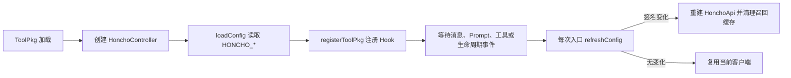
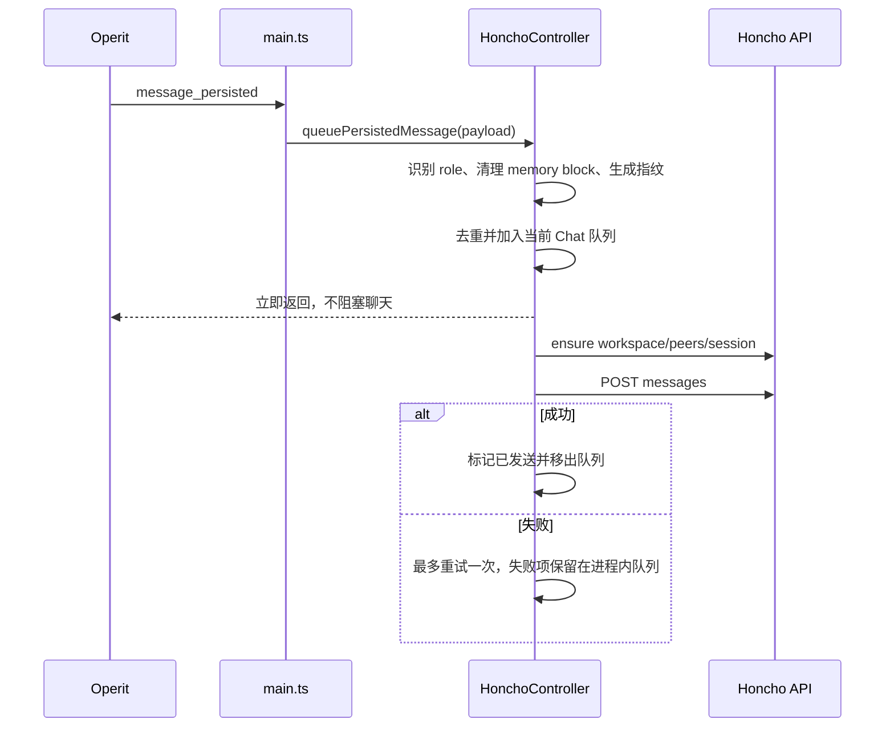
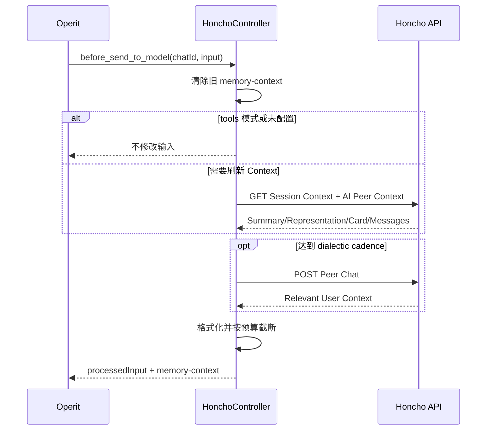

# Operit Honcho 架构说明

本文描述 `operit-honcho` 当前版本的目标、目录、模块边界、运行流程和可见效果。配套 Explore 侧边栏的设计见 [EXPLORE_UI_PLAN.md](./EXPLORE_UI_PLAN.md)。

## 1. 项目定位

`operit-honcho` 是一个 Operit ToolPkg，将 Honcho v3 的跨会话记忆能力接入 Operit。它参考 Hermes Agent 的 Honcho memory provider，但适配 Operit 的消息 Hook、提示词 Hook、工具子包和 Compose DSL 扩展机制。

当前版本提供两条能力链：

1. 自动链路：保存完成的用户/助手消息，并在模型调用前注入相关 Honcho 上下文。
2. 显式链路：通过五个 `honcho:*` 工具读取档案、搜索消息、获取上下文、执行推理和管理持久结论。

插件采用 fail-open 策略。Honcho 未配置、超时或暂时不可用时，原始 Operit 对话仍继续执行。

## 2. 用户可见效果

启用并配置插件后：

- 每条完成的用户和助手消息会异步写入 Honcho。
- 默认每个 Operit Chat 对应一个独立 Honcho Session。
- 同一 Workspace 内的 Peer Card、Representation、Conclusion 和搜索结果可跨 Chat 使用。
- `hybrid` 模式会自动注入上下文，同时保留五个显式工具。
- `context` 模式只自动注入上下文。
- `tools` 模式不自动请求上下文，只在工具调用时访问 Honcho。
- 在主侧边栏打开 `Honcho Explore`，只读浏览 Workspace、Peer、Session、Message 和 Conclusion。
- 查看 Honcho 服务端队列、本地待写消息和最近写入错误；Explorer 网络请求通过 main IPC 执行，UI 不接触 API Key。
- 网络错误只写日志并保留有限的进程内重试状态，不阻塞聊天。

自动注入块使用 `<memory-context>` 包裹，不修改已经持久化的聊天消息。系统提示词只追加一个稳定、短小的模式标记，避免频繁破坏提示词缓存。

## 3. Honcho 数据模型映射

| Operit 概念 | Honcho 概念 | 当前映射 |
| --- | --- | --- |
| 插件配置 | Workspace | `HONCHO_WORKSPACE`，默认 `operit` |
| 使用者 | User Peer | `HONCHO_USER_PEER`，默认 `user` |
| Operit 助手 | AI Peer | `HONCHO_AI_PEER`，默认 `operit` |
| Operit Chat | Session | 默认按 Chat ID 确定性生成 |
| 完成的聊天消息 | Message | 按用户/助手 Peer 归属写入 |
| 长期事实 | Conclusion | 可创建、查询和删除 |
| 用户画像 | Peer Card / Representation | 由 Honcho 维护并用于召回 |

`HONCHO_SESSION_STRATEGY=per-chat` 时，Session ID 形如：

```text
operit_<sanitized-chat-id>_<stable-hash>
```

ID 最长 100 字符。同一 Chat 始终得到相同 Session，不同 Chat 保持隔离。

`HONCHO_SESSION_STRATEGY=global` 时，所有 Chat 共用以 Workspace 为基础的单一 Session。除非明确需要连续混合所有对话，否则推荐保留 `per-chat`。

## 4. 当前目录

```text
operit-honcho/
├── AGENTS.md                     # 仓库内开发和验证规范
├── README.md                     # 安装、配置和工具概览
├── docs/
│   ├── ARCHITECTURE.md           # 本文
│   └── EXPLORE_UI_PLAN.md        # Explore 侧边栏实施计划
├── manifest.json                 # ToolPkg 元数据、main 和子包声明
├── package.json                  # build/test/pack 命令
├── scripts/
│   ├── clean.mjs                 # 清理 dist/build 中间内容
│   ├── pack.mjs                  # 生成 .toolpkg ZIP
│   └── preserve-metadata.mjs     # 恢复并校验工具子包 METADATA
├── src/
│   ├── api.ts                    # Honcho v3 REST 客户端
│   ├── config.ts                 # HONCHO_* 环境变量解析
│   ├── controller.ts             # 状态、注入、写队列和工具分发
│   ├── format.ts                 # 上下文清理、格式化和预算控制
│   ├── globals.d.ts              # Operit ToolPkg 全局类型入口
│   ├── main.ts                   # ToolPkg Hook 注册与入口
│   ├── runtime.ts                # 每个运行上下文内的 Controller 入口
│   └── packages/
│       └── honcho.ts             # METADATA 和五个工具导出
├── tests/
│   └── core.test.js              # Node 测试与 mocked transport
└── tsconfig.json                 # TypeScript 编译配置
```

`dist/`、`build/` 和 `node_modules/` 是生成目录，不进入 Git。

## 5. 模块职责

### `src/config.ts`

- 通过 Operit `getEnv()` 读取 `HONCHO_*` 配置。
- 处理默认值、布尔值、整数范围和枚举值。
- 有 API Key 或显式 Base URL 时自动启用，除非 `HONCHO_ENABLED=false`。
- 生成配置签名，使运行时能在下一次调用时感知环境变量变化。

### `src/api.ts`

- 不依赖第三方 SDK，直接调用 Honcho v3 REST API。
- 统一 Bearer 鉴权、URL 编码、JSON 解析和 HTTP 错误报告。
- 确保 Workspace、Peer 和 Session 存在。
- 限制 Session ID 长度，按 25,000 字符上限切分消息。
- 实现 Context、Peer Card、Message Search、Peer Chat 和 Conclusion 操作。

### `src/controller.ts`

- 每个 Chat 维护独立进程内状态。
- 管理 turn、上下文缓存、dialectic 缓存、消息队列和去重指纹。
- 配置变化时重建 API 客户端并清理召回缓存。
- 根据 cadence 决定何时刷新 Context 和 dialectic。
- 统一分发五个工具操作并返回 JSON 可序列化结果。

### `src/format.ts`

- 清除输入中已经存在的 `<memory-context>`，避免重复嵌套或回写。
- 将 Session Summary、User Representation、Peer Card、AI Representation、AI Card 和 dialectic 组织为稳定文本结构。
- 按近似 token 字符预算和单词边界截断内容。

### `src/main.ts`

注册四类 Operit Hook：

| Hook | 事件/阶段 | 用途 |
| --- | --- | --- |
| Chat Message | `message_persisted` | 异步保存完成消息 |
| System Prompt Compose | `after_compose_system_prompt` | 追加稳定的模式标记 |
| Prompt Finalize | `before_send_to_model` | 向本次用户输入注入记忆上下文 |
| App Lifecycle | `application_on_terminate` | 尝试 flush 未完成写入 |

`src/main.ts` 还注册 `honcho.explorer.request` IPC、`compose_dsl` UI route 和 `main_sidebar_plugins` 导航入口。Explorer UI 通过固定只读 operation allowlist 请求 Workspace、Peer、Session、Message、Conclusion 和队列状态；API Key 只在 main 上下文使用。

### `src/explorer/`

- 定义 Explorer IPC request/response 与分页 DTO。
- 校验 operation、Workspace/Session ID、分页范围和排序参数。
- 将只读请求分发到 `HonchoApi`，并结构化映射认证、权限、缺失、限流和服务端错误。

### `src/ui/honcho_explore/`

- 提供 Overview、Peers、Sessions 和 Conclusions 顶层视图。
- 点击 Session 后显示服务端分页的 Message 时间线，支持返回、刷新、重试和翻页。
- 区分 Hook 活跃 Workspace 与 UI 浏览 Workspace，不写回 `HONCHO_WORKSPACE`。

### `src/packages/honcho.ts`

保留 ToolPkg 子包发现所需的 `METADATA`，并导出：

- `honcho_profile`
- `honcho_search`
- `honcho_context`
- `honcho_reasoning`
- `honcho_conclude`

工具函数直接返回 `Promise<JsonRecord>`。错误被转换为 `{ success: false, error }`，避免运行时得到空结果。

## 6. 运行流程

### 6.1 启动与配置刷新



配置来自 Operit 环境变量，不读取仓库 `.env` 或独立 JSON 配置文件。

### 6.2 消息持久化



同一 Chat 只运行一个 drain。`seen` 与 `inFlight` 同时防止 Hook 重放和请求未完成时的重复写入。

### 6.3 自动召回与注入



Context 与 dialectic 分别使用独立 cadence。任何一个请求失败时，插件尽量复用已有缓存；没有可用内容时不注入。

### 6.4 显式工具调用

```text
Operit Tool Call
  -> honcho:* 子包函数
  -> 参数规范化和默认 Chat ID
  -> HonchoController.call(operation, params)
  -> HonchoApi REST 方法
  -> JSON 结果或结构化错误
```

五个工具与自动 Hook 都通过 `runtime.ts` 获取 Controller，但 ToolPkg 的 `main` 与 `sandbox` 使用不同 JS engine，因此各自拥有独立实例和进程内缓存。两条链路共享同一套配置解析、Session ID、Peer 解析和 API 语义；未来 UI 如需访问 main 状态，必须通过 IPC，而不能依赖 `runtime.ts` 模块变量跨上下文共享。

## 7. 配置

最小 Honcho Cloud 配置：

```text
HONCHO_API_KEY=<key>
HONCHO_WORKSPACE=test
```

常用配置：

| 变量 | 默认值 | 说明 |
| --- | --- | --- |
| `HONCHO_ENABLED` | 自动 | 总开关 |
| `HONCHO_BASE_URL` | `https://api.honcho.dev` | Cloud 或自托管地址 |
| `HONCHO_WORKSPACE` | `operit` | 活跃 Workspace |
| `HONCHO_USER_PEER` | `user` | 用户 Peer |
| `HONCHO_AI_PEER` | `operit` | 助手 Peer |
| `HONCHO_RECALL_MODE` | `hybrid` | `hybrid` / `context` / `tools` |
| `HONCHO_OBSERVATION_MODE` | `directional` | `directional` / `unified` |
| `HONCHO_SAVE_MESSAGES` | `true` | 是否写入完成消息 |
| `HONCHO_SESSION_STRATEGY` | `per-chat` | `per-chat` / `global` |
| `HONCHO_CONTEXT_TOKENS` | `2000` | Context 与注入预算 |
| `HONCHO_CONTEXT_CADENCE` | `1` | Context 刷新轮数 |
| `HONCHO_DIALECTIC_CADENCE` | `2` | 自动推理刷新轮数 |
| `HONCHO_INJECTION_FREQUENCY` | `every-turn` | `every-turn` / `first-turn` |

完整变量表见项目 [README.md](../README.md#configuration)。

## 8. 故障与一致性模型

- HTTP 非 2xx、无效 JSON 和网络错误统一抛出明确错误。
- 自动 Hook 捕获错误并 fail-open；显式工具返回结构化错误。
- 未发送队列只存在于 ToolPkg main 进程，强制杀进程后不会恢复。
- 成功写入后的长期数据由 Honcho 保存，不依赖本地文件。
- 配置切换会重建客户端；已经排队的消息保留其入队时的 API 客户端，避免被错误写入新 Workspace。
- UI、main 和 sandbox 是不同 JS 上下文。未来 UI 不得依赖模块顶层变量共享状态，必须通过 `ToolPkg.ipc` 与 main 通信。

## 9. 构建、测试与安装

```bash
npm test
npm run pack
```

`npm test` 会先清理并编译，再运行 Node 测试。`npm run pack` 会重复测试并生成：

```text
build/operit-honcho-0.1.0.toolpkg
```

`preserve-metadata.mjs` 会在 TypeScript 编译后恢复 `dist/packages/honcho.js` 顶部的 `METADATA`，并校验五个工具名，防止 Operit 无法发现子包。

当前测试覆盖：

- 配置启用判定。
- Memory block 清理和预算。
- ID 生成与长度限制。
- REST 初始化、分块、Context 映射和 Search 过滤。
- Controller 注入、角色解析、去重和失败重试。
- 子包工具结构化错误。
- ToolPkg Hook 注册。

## 10. 当前边界

Phase 1 的只读基础链路已实现：同一 ToolPkg 现在包含 Explorer DTO、分页 API、受控 IPC、主侧边栏入口，以及 Workspace、Peer、Session、Message 和 Conclusion 浏览。真实 `test` Workspace 端到端与多尺寸截图验收仍待在已配置 API Key 的 Operit 环境完成；详情见 [EXPLORE_UI_PLAN.md](./EXPLORE_UI_PLAN.md)。
