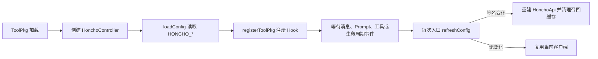
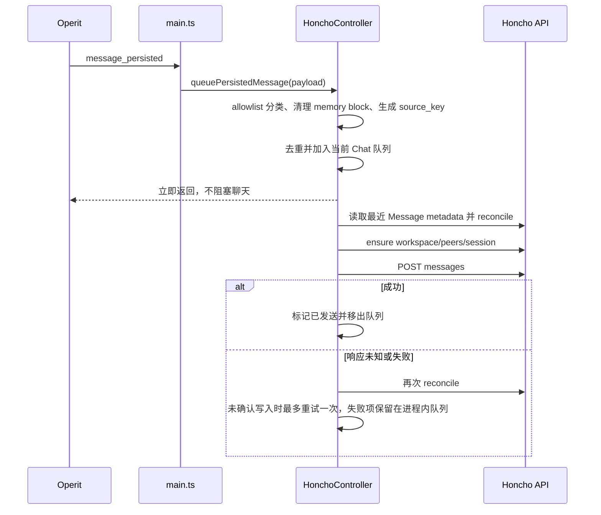
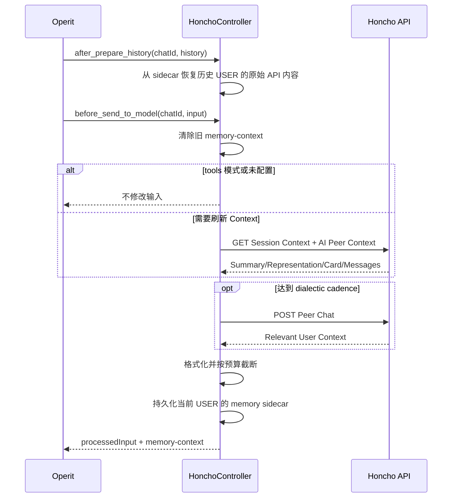

# Operit Honcho 架构说明

本文描述 `operit-honcho` 当前版本的目标、目录、模块边界、运行流程和可见效果。配套 Explore 侧边栏的设计见 [EXPLORE_UI_PLAN.md](./EXPLORE_UI_PLAN.md)。

## 1. 项目定位

`operit-honcho` 是一个 Operit ToolPkg，将 Honcho v3 的跨会话记忆能力接入 Operit。它参考 Hermes Agent 的 Honcho memory provider，但适配 Operit 的消息 Hook、提示词 Hook、工具子包和 Compose DSL 扩展机制。

当前版本提供三条能力链：

1. 自动链路：保存完成的用户/助手消息，并在模型调用前注入相关 Honcho 上下文。
2. 显式链路：通过五个 `honcho:*` 工具读取档案、搜索消息、获取上下文、执行推理和管理持久结论。
3. Explorer 链路：通过 main IPC 在主侧边栏浏览 Honcho 数据和队列状态，并通过受控的两阶段确认迁移或修改活跃 Workspace 的 User/AI 绑定。

插件采用 fail-open 策略。Honcho 未配置、超时或暂时不可用时，原始 Operit 对话仍继续执行。

## 2. 用户可见效果

启用并配置插件后：

- 每条完成的用户和助手消息会异步写入 Honcho。
- 默认每个 Operit Chat 对应一个独立 Honcho Session。
- 同一 Workspace 内的 Peer Card、Representation、Conclusion 和搜索结果可跨 Chat 使用。
- `hybrid` 模式会自动注入上下文，同时保留五个显式工具。
- `context` 模式只自动注入上下文。
- `tools` 模式不自动请求上下文，只在工具调用时访问 Honcho。
- 在主侧边栏打开 `Honcho Explore`，浏览 Workspace、Peer、Session、Message 和 Conclusion，并受控迁移或修改活跃 Workspace 身份。
- 查看 Honcho 服务端队列、本地待写消息和最近写入错误；远端 queue 只在 Overview 独立加载并缓存 15 秒，不阻塞其他列表，Explorer 网络请求均通过 main IPC 执行，UI 不接触 API Key。
- 网络错误只写日志并保留有限的进程内重试状态，不阻塞聊天。

自动注入块使用 `<memory-context>` 包裹，不修改已经持久化的聊天消息。插件把每轮实际发送的动态记忆块保存到私有 prompt sidecar，并在后续模型历史与 Token 估算中逐字恢复；系统提示词只追加一个稳定、短小的模式标记。

## 3. Honcho 数据模型映射

| Operit 概念 | Honcho 概念 | 当前映射 |
| --- | --- | --- |
| 插件配置 | Workspace | `HONCHO_WORKSPACE`，默认 `operit` |
| 使用者 | User Peer | Workspace `metadata.operit_honcho.active_user_peer_id`；metadata 缺失时仅回退旧环境变量 |
| Operit 助手 | AI Peer | Workspace `metadata.operit_honcho.active_ai_peer_id`；metadata 缺失时仅回退旧环境变量 |
| Operit Chat | Session | 默认按 Chat ID 确定性生成 |
| 完成的聊天消息 | Message | 按用户/助手 Peer 归属写入 |
| 长期事实 | Conclusion | 可创建、查询和删除 |
| 用户画像 | Peer Card / Representation | 由 Honcho 维护并用于召回 |

`HONCHO_SESSION_STRATEGY=per-chat` 时，Session ID 形如：

```text
operit_<sanitized-chat-id>_<stable-hash>
```

ID 最长 100 字符。同一 Chat 始终得到相同 Session，不同 Chat 保持隔离。

`HONCHO_SESSION_STRATEGY=global` 时，所有 Chat 共用以 Workspace 为基础的单一 Session。除非明确需要连续混合所有对话，否则推荐保留 `per-chat`。

## 4. 当前目录

```text
operit-honcho/
├── AGENTS.md                     # 仓库内开发和验证规范
├── README.md                     # 安装、配置和工具概览
├── docs/
│   ├── ARCHITECTURE.md           # 本文
│   └── EXPLORE_UI_PLAN.md        # Explore 侧边栏实施计划
├── manifest.json                 # ToolPkg 元数据、main 和子包声明
├── package.json                  # build/test/pack 命令
├── scripts/
│   ├── clean.mjs                 # 清理 dist/build 中间内容
│   ├── pack.mjs                  # 生成 .toolpkg ZIP
│   └── preserve-metadata.mjs     # 恢复并校验工具子包 METADATA
├── src/
│   ├── api.ts                    # Honcho v3 REST 客户端
│   ├── config.ts                 # HONCHO_* 环境变量解析
│   ├── controller.ts             # 状态、注入、写队列和工具分发
│   ├── format.ts                 # 上下文清理、格式化和预算控制
│   ├── hash.ts                   # QuickJS 兼容 SHA-256
│   ├── message.ts                # 消息分类、来源键和 ledger metadata
│   ├── prompt_sidecar.ts         # 私有 Prompt 历史 sidecar
│   ├── globals.d.ts              # Operit ToolPkg 全局类型入口
│   ├── main.ts                   # ToolPkg Hook 注册与入口
│   ├── runtime.ts                # 每个运行上下文内的 Controller 入口
│   └── packages/
│       └── honcho.ts             # METADATA 和五个工具导出
├── tests/
│   ├── core.test.js              # 核心与 Explorer mocked tests
│   └── remediation.test.js       # 消息幂等与 sidecar 回归测试
└── tsconfig.json                 # TypeScript 编译配置
```

`dist/`、`build/` 和 `node_modules/` 是生成目录，不进入 Git。

## 5. 模块职责

### `src/config.ts`

- 通过 Operit `getEnv()` 读取 `HONCHO_*` 配置。
- 处理默认值、布尔值、整数范围和枚举值。
- 有 API Key 或显式 Base URL 时自动启用，除非 `HONCHO_ENABLED=false`。
- 生成配置签名，使运行时能在下一次调用时感知环境变量变化。

### `src/identity.ts`

- 解析和验证 Workspace `metadata.operit_honcho` identity schema。
- metadata 缺失时生成旧环境变量迁移候选，但不让旧值覆盖已有 Workspace 绑定。
- 合并 identity metadata 时保留其他命名空间，并单调增加 `revision`。
- 解析 Peer `display_name`，供工具结果和 Explorer 展示。

### `src/api.ts`

- 不依赖第三方 SDK，直接调用 Honcho v3 REST API。
- 统一 Bearer 鉴权、URL 编码、JSON 解析和 HTTP 错误报告。
- 确保 Workspace、Peer 和 Session 存在。
- 限制 Session ID 长度，按 25,000 字符上限切分消息。
- 为每条 Message 写入稳定来源 metadata，并读取最近 Message 构建跨重载 ledger。
- 实现 Context、Peer Card、Message Search、Peer Chat 和 Conclusion 操作。

### `src/controller.ts`

- 每个 Chat 维护独立进程内状态。
- 管理 turn、上下文缓存、dialectic 缓存、消息队列和去重指纹。
- 对完成且可见的消息执行 allowlist 分类，在写入前及未知响应后 reconcile。
- 配置变化时重建 API 客户端并清理召回缓存。
- 根据 cadence 决定何时刷新 Context 和 dialectic。
- 统一分发五个工具操作并返回 JSON 可序列化结果。

### `src/format.ts`

- 清除输入中已经存在的 `<memory-context>`，避免重复嵌套或回写。
- 将 Session Summary、User Representation、Peer Card、AI Representation、AI Card 和 dialectic 组织为稳定文本结构。
- 按近似 token 字符预算和单词边界截断内容。

### `src/main.ts`

注册以下 Operit Hook：

| Hook | 事件/阶段 | 用途 |
| --- | --- | --- |
| Chat Message | `message_persisted` | 异步保存完成消息 |
| System Prompt Compose | `after_compose_system_prompt` | 追加稳定的模式标记 |
| Prompt History | `after_prepare_history` | 从私有 sidecar 恢复历史用户 turn |
| Prompt Estimate History | `after_prepare_history` | 让 Token 估算使用相同历史内容 |
| Prompt Finalize | `before_send_to_model` | 向本次用户输入注入记忆上下文 |
| App Lifecycle | `application_on_terminate` | 尝试 flush 未完成写入 |

`src/main.ts` 在 `manifest.main` 模块顶层注册 `honcho.explorer.request` IPC，并通过 `registerToolPkg()` 注册 `compose_dsl` UI route 和 `main_sidebar_plugins` 导航入口。顶层 IPC 注册确保 handler 绑定到持久 main 上下文，不会随一次注册调用结束而失效。Explorer UI 通过固定 operation allowlist 请求 Workspace、Peer、Peer Card、Session、Message、Conclusion 和队列状态；身份与 Peer 变更使用受控的预览/确认 operation，API Key 只在 main 上下文使用。

### `src/explorer/`

- 定义 Explorer IPC request/response、分页 DTO、Peer/Card DTO 和受控变更预览 DTO。
- 校验 operation、Workspace/Peer/Session ID、分页范围、排序参数和 Peer mutation 参数。
- 身份写入仅允许活跃 Hook Workspace，先校验 Peer 并签发绑定原 revision 的五分钟单次确认令牌，提交时再次检查 revision 后才更新 metadata。
- Peer 创建、显示名、归档/恢复和 Session 移除同样仅允许活跃 Hook Workspace；提交令牌绑定配置、Workspace、Peer、操作参数和变更前状态，并在 metadata 或成员关系并发变化时拒绝提交。
- Peer ID 不提供重命名或删除语义；显示名与归档状态只写入 `metadata.operit_honcho`，Session 移除只改变成员关系。
- 将本地 `status` 与远端 `queue_status` 分离；queue 按配置与 Workspace 缓存 15 秒并合并并发请求。
- 将读取请求分发到 `HonchoApi`，并结构化映射认证、权限、缺失、限流和服务端错误。

### `src/ui/honcho_explore/`

- 提供 Overview、Peers、Sessions 和 Conclusions 顶层视图。
- Overview 提供旧身份迁移和 User/AI 角色改绑；确认区展示 Workspace、旧/新 Peer、revision 和影响范围，请求完成前禁止重复提交。
- Peers 提供显示名、原始 ID、角色、归档状态、详情、创建/改名/归档/恢复、角色改绑和分页 Session 成员管理；浏览非活跃 Workspace 时保持只读。
- Peer Card 详情明确显示 observer 与 target，默认使用当前 AI Peer 作为 observer，支持从参与者菜单切换方向并手动刷新。
- 点击 Session 后显示服务端分页的 Message 时间线，支持返回、刷新、重试和翻页。
- 所有 API 时间统一格式化为 `Asia/Shanghai`；QuickJS 缺少时区数据时使用确定性的 UTC+8 fallback。
- 区分 Hook 活跃 Workspace 与 UI 浏览 Workspace，不写回 `HONCHO_WORKSPACE`。

### `src/packages/honcho.ts`

保留 ToolPkg 子包发现所需的 `METADATA`，并导出：

- `honcho_profile`
- `honcho_search`
- `honcho_context`
- `honcho_reasoning`
- `honcho_conclude`

工具函数直接返回 `Promise<JsonRecord>`。错误被转换为 `{ success: false, error }`，避免运行时得到空结果。

## 6. 运行流程

### 6.1 启动与配置刷新



配置来自 Operit 环境变量，不读取仓库 `.env` 或独立 JSON 配置文件。

### 6.2 消息持久化



同一 Chat 只运行一个 drain。`seen` 与 `inFlight` 同时防止 Hook 重放和请求未完成时的重复写入。

### 6.3 自动召回与注入



Context 与 dialectic 分别使用独立 cadence。任何一个请求失败时，插件尽量复用已有缓存；没有可用内容时不注入。

### 6.4 显式工具调用

```text
Operit Tool Call
  -> honcho:* 子包函数
  -> 参数规范化和默认 Chat ID
  -> HonchoController.call(operation, params)
  -> HonchoApi REST 方法
  -> JSON 结果或结构化错误
```

五个工具与自动 Hook 都通过 `runtime.ts` 获取 Controller，但 ToolPkg 的 `main` 与 `sandbox` 使用不同 JS engine，因此各自拥有独立实例和进程内缓存。两条链路共享同一套配置解析、Session ID、Peer 解析和 API 语义；未来 UI 如需访问 main 状态，必须通过 IPC，而不能依赖 `runtime.ts` 模块变量跨上下文共享。

## 7. 配置

最小 Honcho Cloud 配置：

```text
HONCHO_API_KEY=<key>
HONCHO_WORKSPACE=test
```

常用配置：

| 变量 | 默认值 | 说明 |
| --- | --- | --- |
| `HONCHO_ENABLED` | 自动 | 总开关 |
| `HONCHO_BASE_URL` | `https://api.honcho.dev` | Cloud 或自托管地址 |
| `HONCHO_WORKSPACE` | `operit` | 活跃 Workspace |
| `HONCHO_RECALL_MODE` | `hybrid` | `hybrid` / `context` / `tools` |
| `HONCHO_OBSERVATION_MODE` | `directional` | `directional` / `unified` |
| `HONCHO_SAVE_MESSAGES` | `true` | 是否写入完成消息 |
| `HONCHO_SESSION_STRATEGY` | `per-chat` | `per-chat` / `global` |
| `HONCHO_CONTEXT_TOKENS` | `2000` | Context 与注入预算 |
| `HONCHO_CONTEXT_CADENCE` | `1` | Context 刷新轮数 |
| `HONCHO_DIALECTIC_CADENCE` | `2` | 自动推理刷新轮数 |
| `HONCHO_INJECTION_FREQUENCY` | `every-turn` | `every-turn` / `first-turn` |

完整变量表见项目 [README.md](../README.md#configuration)。

## 8. 故障与一致性模型

- HTTP 非 2xx、无效 JSON 和网络错误统一抛出明确错误。
- 自动 Hook 捕获错误并 fail-open；显式工具返回结构化错误。
- 未发送队列只存在于 ToolPkg main 进程，强制杀进程后不会恢复；已确认写入的来源 key 可从 Honcho metadata 恢复。
- Prompt sidecar 位于 ToolPkg 私有配置目录，按 Chat 分片，使用 90 天 TTL、每 Chat 记录上限、1 MiB 单文件上限和 8 MiB 全局 LRU 回收；损坏文件会隔离，Overview 提供带动态状态校验和文字确认的清理入口。
- 成功写入后的长期数据由 Honcho 保存，不依赖本地文件。
- 配置切换会重建客户端；已经排队的消息保留其入队时的 API 客户端，避免被错误写入新 Workspace。
- UI、main 和 sandbox 是不同 JS 上下文。未来 UI 不得依赖模块顶层变量共享状态，必须通过 `ToolPkg.ipc` 与 main 通信。

## 9. 构建、测试与安装

```bash
npm test
npm run pack
```

`npm test` 会先清理并编译，再运行 Node 测试。`npm run pack` 会重复测试并生成：

```text
build/operit-honcho-0.1.0.toolpkg
```

`preserve-metadata.mjs` 会在 TypeScript 编译后恢复 `dist/packages/honcho.js` 顶部的 `METADATA`，并校验五个工具名，防止 Operit 无法发现子包。

当前测试覆盖：

- 配置启用判定。
- Memory block 清理和预算。
- ID 生成与长度限制。
- REST 初始化、分块、Context 映射和 Search 过滤。
- Controller 注入、角色解析、去重和失败重试。
- Message allowlist、稳定来源 metadata、跨重载 reconcile 和 Conclusion 精确幂等。
- Prompt sidecar 重载恢复、同轮并发合并、损坏隔离、写入失败 fail-open、单文件/总字节上限、LRU 回收和清空。
- Conclusion 服务端筛选、语义查询、动态方向显示、精确重复扫描、单次确认删除和部分失败。
- Explorer 30 秒读取缓存、并发请求合并、强制刷新和写后失效。
- Peer REST 映射、详情/Card 方向、归档保护、Session 移除、确认令牌复用和并发冲突。
- Peer 详情 UI、Card 空状态/方向、角色与 Session 确认面板。
- 子包工具结构化错误。
- ToolPkg Hook 注册。

## 10. 当前边界

阶段 D/E 的代码与自动回归已经完成：Explorer 支持 Conclusion 方向显示、服务端筛选/语义查询、精确重复报告与受控清理，并具备 30 秒读缓存、并发请求合并、强制刷新、HTTP/IPC 耗时日志和 Prompt sidecar 容量/清理管理。真实 `test` Workspace 的筛选与删除闭环、真机多尺寸视觉检查、缓存 P50/P95、重载前缀与 cachedInputTokens 实测仍待完成，因此阶段 D/E 尚未标记为真机验收完成；详情见 [EXPLORE_UI_PLAN.md](./EXPLORE_UI_PLAN.md) 和 [EXPLORER_REMEDIATION_PLAN.md](./EXPLORER_REMEDIATION_PLAN.md)。
